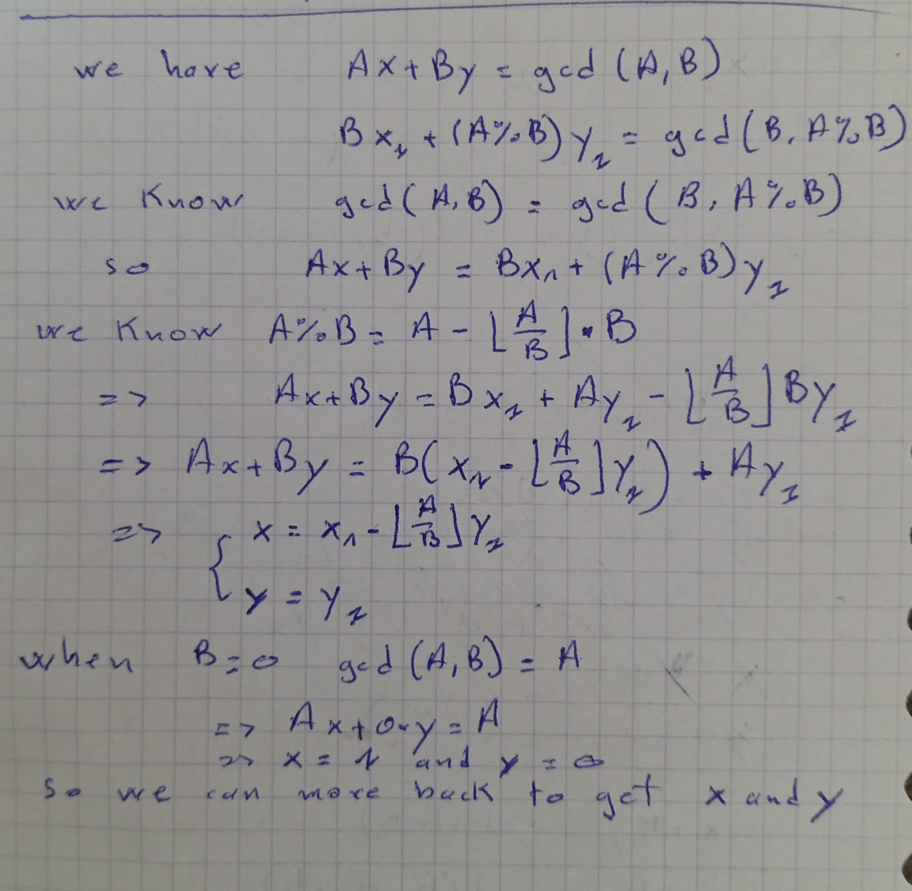

## Extended Euclid Algorithm
-------------------------------
To solve the equation Ax+By=gcd(A,B) (gcd stands for greater common divisor)
You need to follow this method

ExtendedEuclidAlgorithm.jpg
